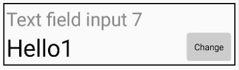

# androidDevControl

The app serves as a front-end to a system designed to control physical hardware.
Hardware refers to devices such as Raspberry Pi, ESP32, or Arduino that have internet connectivity (HTTP and WS).

In this diagram, each user has the ability to control their own devices as the device administrator. Additionally, users can control specific parts of other devices if they have been granted the necessary permissions by the respective device administrator.

The device itself is designed to incorporate its own input/output (IO) capabilities through electronic components such as LEDs, temperature sensors, light sensors, relays, and more.
Values from these sensors or actuators are then transmitted to or received from the server.

Video demonstrations:
        https://www.youtube.com/watch?v=RpGQwCulJrs
        https://www.youtube.com/shorts/8FY1SPaJZHM
        https://www.youtube.com/shorts/rtwHEy4xCRg

These "values" can be controlled from an Android device using one of the available UI controls.

Numeric field control:
The numeric field control is defined with properties such as minimal value, maximal value, and value step.
This control is specifically designed to allow users to adjust the brightness of a LED strip.

Text field control:
The text field control allows the user to send or receive a string to or from a device.
When the „Change“ button is clicked, a dialog will appear.

Boolean field control:
The button field control allows the user to send or receive a boolean value to or from a device in an intuitive button-like format.

Multiple choice field control:
The multiple-choice field allows the user to select a value from a list of options presented in an aesthetically pleasing dialog form.

RGB field control:

The RGB field control enables the user to send or receive an RGB value to or from a device through an attractive RGB dialog form.
This control is specifically designed for setting colors for an RGB LED strip.

These controls can be organised in groups and complex groups.
A group is essentially an array of fields with a name.

On the other hand, a complex group introduces the concept of states, which enables the user to control a single input/output (I/O) in different ways, as illustrated in the image below.

App screens:

Login/Register:

User logs in with his username and password and while creating the account has the option to add email which he has to confirm (user recives an automated email).
Email adress can be used to recover the account (by reciving an automated email) or recive notifications (notifications are not yet implemented).

Main screen:
On the main screen the user sees the list of devices to which he has access.
Next to every device the user can see is that device online at the moment.
From the main screen he has access to the user settings and the admin panel.

Device control screen:

When the user clicks on the device he can see all the device controls to which he has access, so basicly a list of groups and complex groups.

User settings:

From user settings the user can 
    - change password
    - delete user account
    - logout
    - logout from all instaces (all other app instances with that user logged in get a message over WSS that the auth token has expired)
    - add email if he hasn't done that during registration

Admin panel:

When the user clicks on the admin panel he can see a list of device for which he is the admin.

When the user clicks on the device a he can see a list of actions an admin can do on his device.

From admin panel an admin can:
    - add permission to users so that other users can interact with the device.
    - see all permissions that other users have on his device
    - delete device
    - transfer the admin rights to some other user

Add permissions screen:
The user has to choose to what user does he want to give the permission and to what entity inside the device (entire device, specific group, specific field or specific complex group) and does he want to assign a read or a write permission.
Read permission don't allow user to alter the state of a field, only to see what the value is.

See all permissions screen:

In this screen, the admin can see what users have what permissions on his device and can delete specific permissions.

Change admin screen:

On this screen the admin can select the new admin for that device.

